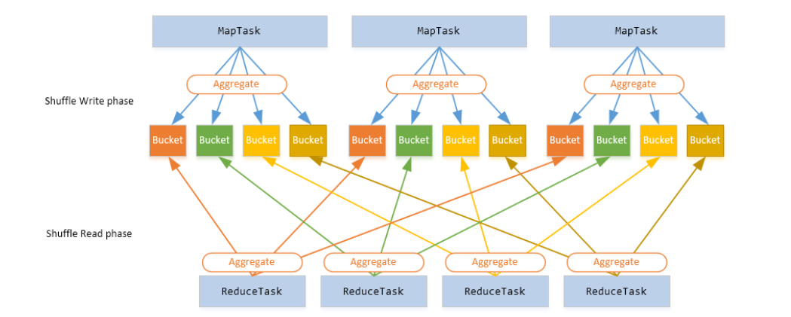

** **
# Big data platform (Spark) performance acceleration

## 1. Vision and Goals Of The Project: 

Shuffling could become the scaling bottleneck when running many small tasks in multistage data analysis jobs. In certain circumstances, data is too large to fit into memory, intermediate data has to keep on disks, which makes a large amount of small random I/O requests significantly slow down the performance of spark.

Optimize the partitioning and shuffle algorithms in Spark, to perform more efficient I/O and shuffling. There is believed to be a significant opportunity for improvement in changing the I/O patterns so that large data files are read more efficiently from disk.

* Improve the efficiency of the Spark shuffle phase, better than vanilla spark.
* Decrease the number of I/O operations for the reduce phase.
* Implement the N-way merge in the shuffle phase for improving efficiency.
* Experiment over different single and multi-stage jobs.
* Analyze, using different metrics, the performance improvement over vanilla spark.

## 2. Users/Personas Of The Project
People developing Spark applications.

## 3. Scope and Features Of The Project:
### Scope:
* Provide a design architecture of Riffle proposed in the riffle paper.
* Analyze and understand the existing code of spark, especially that of the shuffle phase.
* Setup both local and cloud environments to run spark jobs.
* Setup both local and cloud environments to run spark jobs.
* Provide a detailed analysis based on metrics (speed-up, diffe

## 4. Solution Concept

More research work needs to be done to correctly identify possible solutions.

 Here are some references we are using at the moment to work on the solution:
https://haoyuzhang.org/publications/riffle-eurosys18.pdf

## 5. Acceptance criteria
Improvements during the shuffling phase:
* Fewer I/O requests in general
* Less disk I/O during shuffling phase
* Less running time

**Stretch Goals:**
* Test the service/plug-in on different categories of Spark applications and deployment environment.
* Design some simple strategies that decide when to merge shuffling overhead when not to.
* Provide explanations of why there is no general method which could apply to all datasets
* Implement improvements on data partitioning phase 

## 6. Release Planning
### Tasks: ###

* Setting up the Spark Environment (latest version)
* Learn more about Spark and Hadoop
* Finding an appropriate dataset/project to perform analysis
* Run Spark applications and profile Spark performance on the dataset identified in step 3
* Evaluate possible benchmarks:
  * Total time of Spark application (e.g., Sorting, Spark Query)
  * IOPs on hard drives
* Research: Where to modify/extend 
* Implement a new shuffle/merge manager, and insert it into the Spark software stack.
* Profile the after enhancement Spark performance

### Timeline: ###

**16th September - 29th September:** 

Setup environment, find two or three proper datasets, detailed research on possible solutions, run some sample queries/jobs

**30th September - 13th October:**

Find the bottleneck of queries/jobs, hard-code some plugins to test if directions are correct, design algorithm/strategies

**14th October - 27th October:**

Work on the backlog, Test the correctness of algorithm

**28th October - 10th November:**

Improvements/ Fine tune of algorithm/strategies

**11th November - 24th November:**

Continue working on possible improvements

**25th November - 8th December:**

Make a final presentation, Focus on stretch goals

** **
